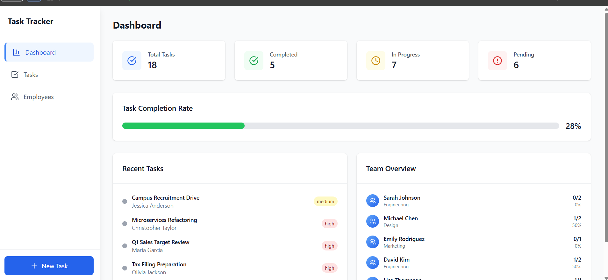
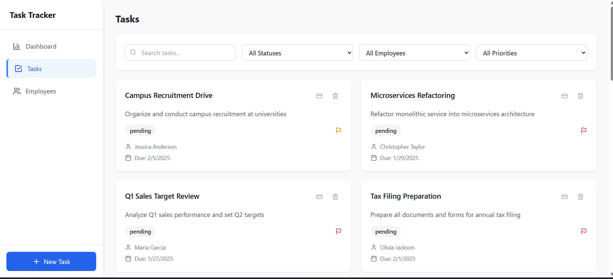
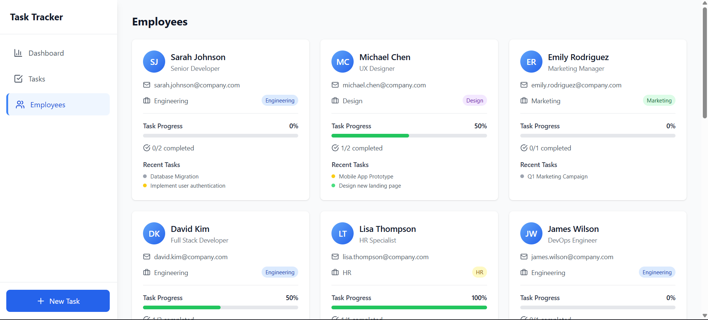
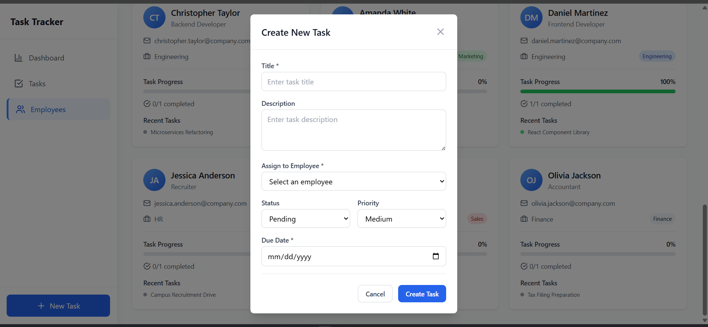
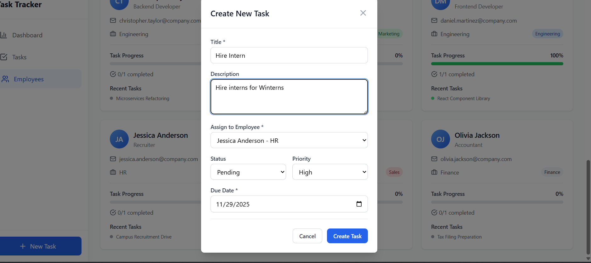

# Employee Task Tracker

A full-stack web application for managing employees and their tasks. Built with React, TypeScript, Node.js, Express, and MongoDB.

## 📋 Table of Contents

- [Features](#features)
- [Tech Stack](#tech-stack)
- [Prerequisites](#prerequisites)
- [Installation](#installation)
- [Project Structure](#project-structure)
- [API Documentation](#api-documentation)
- [Usage](#usage)
- [Troubleshooting](#troubleshooting)

## ✨ Features

- **Dashboard**: View task statistics, completion rates, and employee performance metrics
- **Task Management**: Create, update, delete, and filter tasks by status, employee, or priority
- **Employee Management**: View all employees with their associated task counts
- **Real-time Updates**: Automatic refresh of data after task operations
- **Responsive Design**: Modern, mobile-friendly UI built with Tailwind CSS
- **Task Filtering**: Filter tasks by status (pending, in-progress, completed, cancelled), employee, or priority level
- **Task Priorities**: Assign and track tasks with low, medium, or high priority levels

## 🛠 Tech Stack

### Frontend

- **React 18** - UI library
- **TypeScript** - Type safety
- **Vite** - Build tool and dev server
- **Tailwind CSS** - Utility-first CSS framework
- **Lucide React** - Icon library

### Backend

- **Node.js** - Runtime environment
- **Express.js** - Web framework
- **MongoDB** - Database (via Mongoose)
- **CORS** - Cross-origin resource sharing
- **dotenv** - Environment variable management

## 📦 Prerequisites

Before you begin, ensure you have the following installed:

- **Node.js** (v14 or higher)
- **npm** or **yarn**
- **MongoDB Atlas account** (or local MongoDB instance)

## 🚀 Installation

### 1. Clone the Repository

```bash
git clone <repository-url>
cd ProU_assesment_task3
```

### 2. Backend Setup

1. Navigate to the backend directory:

```bash
cd backend
```

2. Install dependencies:

```bash
npm install
```

3. Create a `.env` file in the `backend` directory:

```env
MONGODB_URI=your_mongodb_connection_string
PORT=5000
```

4. Seed the database with initial data (optional but recommended):

```bash
npm run seed
```

5. Start the backend server:

```bash
# Production mode
npm start

# Development mode with auto-reload
npm run dev
```

The backend API will be running on `http://localhost:5000`

### 3. Frontend Setup

1. Navigate to the frontend directory (from project root):

```bash
cd frontend
```

2. Install dependencies:

```bash
npm install
```

3. Start the development server:

```bash
npm run dev
```

The frontend will be running on `http://localhost:5173` (or another port if 5173 is busy)

4. Build for production:

```bash
npm run build
```

## 📁 Project Structure

```
ProU_assesment_task3/
├── backend/
│   ├── config/
│   │   └── db.js              # Database connection configuration
│   ├── models/
│   │   ├── Employee.js        # Employee data model
│   │   └── Task.js            # Task data model
│   ├── routes/
│   │   ├── dashboard.js       # Dashboard API routes
│   │   ├── employees.js       # Employee API routes
│   │   └── tasks.js           # Task API routes
│   ├── scripts/
│   │   └── seed.js            # Database seeding script
│   ├── server.js              # Express server entry point
│   ├── package.json
│   └── .env                   # Environment variables (create this)
│
├── frontend/
│   ├── src/
│   │   ├── components/
│   │   │   ├── Dashboard.tsx      # Dashboard component
│   │   │   ├── EmployeeList.tsx    # Employee list component
│   │   │   ├── Sidebar.tsx         # Navigation sidebar
│   │   │   ├── TaskList.tsx        # Task list component
│   │   │   └── TaskModal.tsx       # Task creation/editing modal
│   │   ├── data/
│   │   │   └── mockData.ts         # Mock data (if needed)
│   │   ├── services/
│   │   │   └── api.ts              # API service layer
│   │   ├── types/
│   │   │   └── index.ts            # TypeScript type definitions
│   │   ├── App.tsx                 # Main application component
│   │   ├── main.tsx                # Application entry point
│   │   └── index.css               # Global styles
│   ├── package.json
│   └── vite.config.ts              # Vite configuration
│
├── SETUP.md                        # Detailed setup guide
└── README.md                       # This file
```

## 📡 API Documentation

### Base URL

```
http://localhost:5000/api
```

### Health Check

- **GET** `/api/health`
  - Returns server status

### Employees

- **GET** `/api/employees`
  - Get all employees with task counts
  - Response: Array of employee objects with `totalTasks` and `completedTasks`

### Tasks

- **GET** `/api/tasks`

  - Get all tasks
  - Query Parameters:
    - `status` - Filter by status (pending, in-progress, completed, cancelled)
    - `employeeId` - Filter by employee ID
    - `priority` - Filter by priority (low, medium, high)
  - Example: `/api/tasks?status=completed&priority=high`

- **GET** `/api/tasks/:id`

  - Get a single task by ID

- **POST** `/api/tasks`

  - Create a new task
  - Request Body:
    ```json
    {
      "title": "Task title",
      "description": "Task description",
      "status": "pending",
      "priority": "medium",
      "employeeId": "employee_id",
      "dueDate": "2024-12-31"
    }
    ```

- **PUT** `/api/tasks/:id`

  - Update an existing task
  - Request Body: Same as POST

- **DELETE** `/api/tasks/:id`
  - Delete a task by ID

### Dashboard

- **GET** `/api/dashboard`
  - Get dashboard summary statistics
  - Response includes:
    - Total tasks
    - Tasks by status
    - Tasks by priority
    - Completion rates

## 💻 Usage

1. **Start both servers**: Make sure both backend and frontend servers are running
2. **Access the application**: Open your browser and navigate to `http://localhost:5173`
3. **Navigate the app**:
   - **Dashboard**: View overview statistics and metrics
   - **Tasks**: View, create, edit, and delete tasks
   - **Employees**: View all employees and their task assignments

### Creating a Task

1. Click the "Create Task" button in the sidebar
2. Fill in the task details:
   - Title (required)
   - Description
   - Status (pending, in-progress, completed, cancelled)
   - Priority (low, medium, high)
   - Assign to an employee
   - Set due date
3. Click "Save" to create the task

### Filtering Tasks

Use the filter options in the Task List view to filter by:

- Status
- Employee
- Priority

## 🔧 Troubleshooting

### Backend Issues

- **Server won't start**:

  - Verify MongoDB URI is correct in `.env` file
  - Ensure MongoDB is accessible (check network/firewall settings)
  - Check if port 5000 is already in use

- **Database connection errors**:

  - Verify your MongoDB connection string
  - Check if MongoDB Atlas IP whitelist includes your IP address
  - Ensure database credentials are correct

- **No data showing**:
  - Run `npm run seed` in the backend directory to populate initial data
  - Check database connection status

### Frontend Issues

- **Can't connect to API**:

  - Ensure backend server is running on port 5000
  - Check browser console for CORS errors
  - Verify API base URL in `src/services/api.ts`

- **Build errors**:

  - Run `npm install` to ensure all dependencies are installed
  - Check Node.js version compatibility
  - Clear `node_modules` and reinstall if needed

- **TypeScript errors**:
  - Run `npm run typecheck` to identify type issues
  - Ensure all types are properly defined in `src/types/index.ts`

## 📝 Scripts

### Backend Scripts

- `npm start` - Start production server
- `npm run dev` - Start development server with auto-reload
- `npm run seed` - Seed database with initial data

### Frontend Scripts

- `npm run dev` - Start development server
- `npm run build` - Build for production
- `npm run preview` - Preview production build
- `npm run lint` - Run ESLint
- `npm run typecheck` - Run TypeScript type checking

## 📸 Project Screenshots

### Dashboard



### Task List



### Employees Page



## Adding Task




## 📄 License

This project is part of a ProU assessment task.

---

For detailed setup instructions, see [SETUP.md](./SETUP.md)
